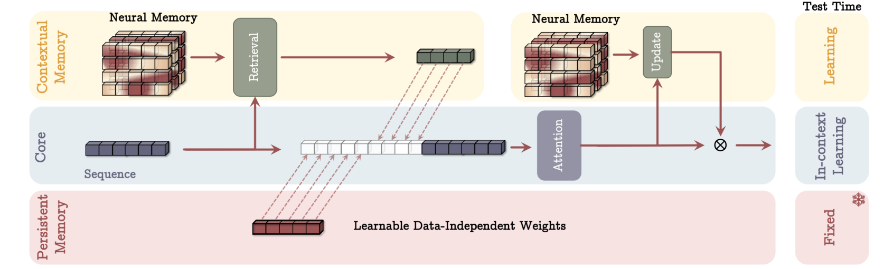

# Titans: Learning to Memorize at Test Time

A proof-of-concept implementation of Titans, introduced by [Behrouz et al. (2025)](https://arxiv.org/pdf/2501.00663). The performance is validated on a synthetic sine-wave dataset and a real-world [Wind Power Forecasting dataset](https://www.kaggle.com/datasets/theforcecoder/wind-power-forecasting/data) from Kaggle.

## Overview

What exactly are Titans? On a high level, they are seem to be just Transformer models that additionally contain a Neural Memory Module (NMM), responsible for remembering information seen over time.
Its long-term memory resembles the general format of recursive neural networks.
The difference is that instead of keeping the hidden recursive state as a vector or matrix, the NMM learns a key-value mapping, given key and value matrices $W_ K, W_ V$.
The paper also draws connections between the NMM and Linear Transformers (LTs), suggesting its efficiency, while the combination with standard Transformers, acting as short-term memory, is claimed to achieve state-of-the-art performance.

## Neural Memory Module

The authors of Titans introduce the Neural Memory Module as a form of recursive state, which in contrast to vector or matrix representations can capture non-linear dependencies between data. Instead, they aim to embed the long-term knowledge in a neural network, learning a map from a key space to the space of values, and retrieving the relevant knowledge by processing specific queries. Motivated by the self-attention mechanism, they consider three linear maps $W_ Q, W_ K, W_ V$. Then, for input $x$, the corresponding query, key and value vectors, are respectively $q = x W_ Q$, $k = x W_ K$ and $v = x W_ V$. The Neural Memory Module is optimized to minimize

$$ \lVert \mathcal M (k) - v \rVert_ 2^2$$

i.e. learns the mapping from the space of keys to the space of values. The knowledge is then recovered by considering $y = \mathcal{M} (q)$, which shows an analogy to the self-attention mechanism, in which if a query is similar to a key, the corresponding value receives high weight. Here, if the query vector is similar to the key vector, we can approximate $\mathcal{M} (q) \approx \mathcal{M} (k) \approx v$, so the correct value is recovered.

---

### Details about $W_ Q, W_ K, W_ V$

The two following problems are the most confusing thigns for me in the whole paper:
1) What exactly is the training objective?
2) Where do the matrices $W_ Q, W_ K, W_ V$ come from?

For the first problem, the paper states that the NMM is trained to optimize $\lVert \mathcal M (k) - v \rVert_ 2^2$. The authors moreover claim that using a non-linear transformation for the NMM leads to a more expressive model. However, if both vectors $k$ and $v$ are obtained from the same input $x$ using linear transformation, a model $\mathcal{M}' = W_ K ^{-1} W_ V$ is a perfect solution. This does not align well with the author's comment that:

> That is, from the meta learning or online learning perspective (Yu Sun et al. 2024), using a matrix-valued memory $M = W \in R ^ {d_ {in} \times d_ {in}}$ is equivalent to optimize $l(W_ {t-1}, x_ t) = \lVert W_ {t-1} k_ t - v_ t\rVert_ 2^2$ which is an online linear regression objective and so the optimal solution assumes the underlying dependency of historical data is linear.

which assumes that the relation between $k$ and $v$ is not linear? In Section 4.4, they say that:

> In our implementation, we use SiLU(.) activation (Elfwing, Uchibe, and Doya 2018) as the non-linear activation for computing query, key, and values and normalize queries and keys using $l_ 2$-norm.

Given this statement, I assumed that the stated NMM training objective is not precise and devised the following:

**Assumption 1.:** The Neural Memory Module $\mathcal{M}$ is trained to minimize $l(\mathcal{M}; x) = \lVert \mathcal M (k) - v \rVert_ 2^2$ where $k = \text{norm}_ {l_ 2}(\text{SiLU}(x W_ K))$ and $v = \text{SiLU}(x W_ V)$.

Returning to the second question, the origin of the matrices $W_ K, W_ V$ remains confusing for me. Since $W_ Q$ plays a role in the main pipeline (retrieving information from the NMM), it can be trained together with the main architecture. On the other hand, during this training, there is no learning signal for $W_ K \text{ and } W_ V$, as they are used only during the update of NMM. It makes no sense to train them jointly with the NMM, since this could easily lead to a collapse, and authors also specify in their paper that:

> $W_ K$ and $W_ V$ are hyperparameters in the above [NMM] loss function.

For a moment, I believed that these matrices may refer to the weights of the co-existing attention module, but this also does not seem to be the case:

> Although in the above, we discussed MAL as the combination of LMMs and attention in a sequential manner, one simple variant of MAL is to treat LMM as a sequence model without any attention.

As a result, seing no clear way how to train $W_ K$ and $W_ V$, I made the following assumption:

**Assumption 2.:** The key and value matrices whose relation the NMM is trained to approximate, are randomly sampled at the beginning of the training and remain constant throughout the whole training process. The parameter $W_ Q$ remains trainable, allowing to learn a mapping retrieving relevant values.

---

### Training procedure

The objective for training the NMM is described above in **Assumption 1.**. Authors introduce a novel methodology of updating the weights of the NMM, based on a "surprise principle". The update equations are as follows:

$$
\mathcal{M}_ t = (1-\alpha_ t)\cdot \mathcal{M}_ {t-1} + S_ {t}
$$

$$
S_ {t} = \eta_ t \cdot S_ {t-1} - \theta_ t \cdot\nabla l(\mathcal{M}_ {t-1}; x_ t)
$$

where $S_ t$ is the surprise factor updating the weights. The additional parameters control the rates of:

- $\alpha_ t$ - weight decay
- $\eta_ t$ - forgetting factor
- $\theta_t$ - surprise power

In the paper, these are trainable and depend on the current input $x_t$. For simplicity, in this project, I considered them to be constant hyperparameters, chosen before training. To this end, I set $\alpha = 0.001$ and validated a number of configurations for $\eta$ and $\theta$, ultimately deciding to select $\eta = 0.9$ and $\theta = 0.01$.
Note that these parameters could be trained unwrapping the definition of $\mathcal{M}_ {t-1}$ in $\nabla l(\mathcal{M}_ {t-1}; x_ t)$, but this significantly increases the complexity of implementation. However, this would be one of the major conceptual improvements over this proof-of-concept project, except for scalability, that could positively impact the results. 

**Assumption 3.:** The NMM update parameters are constant, chosen to be $(\alpha, \eta, \theta) = (0.001, 0.9, 0.01)$  

Under this assumption, the updates become a Stochastic Gradient Descent with momentum and weight decay. Indeed, taking $P_ t = - \frac{1-\eta}{\theta} \cdot S_ t$, we have:

$$
\mathcal{M}_ t = (1-\alpha)\cdot \mathcal{M}_ {t-1} - \frac{\theta}{1-\eta}\cdot P_ {t}
$$

$$
P_ {t} = \eta \cdot P_ {t-1} + (1-\eta) \cdot\nabla l(\mathcal{M}_ {t-1}; x_ t)
$$

Note that in such scenario, to ensure stable training, we should select high $\eta \in [0.8, 1)$ and a really small value for $\theta$. However, during testing, one could consider boosting $\theta$, so that the update to the current context happens quicker.  

## Titan (MAC)

### One Layer

A single layer of a Titam "Memory As Context" (MAC) architecture integrates the Neural Memory Module in a retrieval-update fashion. Its implementation is available in `titans.py` as `TitanMACLayer` class. Given an input sequence $x \in \mathbb{R}^{n \times d_ {hid}} $ consisting of $n$ tokens, each represented by a $d_ {hid}$-dimensional vector, the output of the layer is evaluated as follows:

1. We first retrieve embeddings $h$ from the NMM $\mathcal{M}$ by $h = \mathcal{M}(q) \in  \mathbb{R}^{n \times d_ {hid}}$ where $q = \text{norm}_ {l_ 2}(\text{SiLU}(x W_ Q))$.
2. We create a new joint embedding by concatenating a trainable data-independent "persistent memory" weights $p \in \mathbb{R}^{N_ p \times d_ {hid}}$, the retrieved long-memory values $h$ and the original input $x$:

$$
\tilde{x} = \left[ h \lVert p \rVert x \right] \in \mathbb{R}^{2n + N_ p}
$$

3. We pass $y$ through the attention-based module, deriving $\tilde{y} = \text{Attn}(\tilde{x})$. Afterwards, to match the original dimension of the sequence, we run it through a SiLU-activated fully connected layer, obtaining $y \in \mathbb{R}^{n\times d_ {hid}}$
4. We update the NMM by passing $q' = \text{norm}_ {l_ 2}(\text{SiLU}(y \cdot W_ Q))$.
5. We again pass $q'$ thorugh the NMM, this time with updated weights, receiving a long-term memory $z \in\mathbb{R}^{n\times d_ {hid}}$.
6. Finally, we gate the output $y$ of the attention module using $z$ and return the obtained sequence.

### Processing long sequences

Due to the addition of the long-term memory module, the authors of Titans claim their architecture can be applied to very long sequences. In particular, they suggest the following methodology for processing sequences of $N$ tokens, for the cases where $N$ is significantly larger than the available context window $C$ of the attention module. For simplicity, assume $N = 0 \mod C$, otherwise add some null tokens at the beginning. Given a sequence $x$ consisting of $N$ elements $x_ 0, ..., x_ {N-1}$, Titan (MAC):

1. Divides this sequence into $\frac{N}{C}$ chunks $x_ {[0, C)}, x_ {[C, 2C)}, ..., x_{[N-C, N)}$.
2. Runs the first $\frac{N}{C}-1$ chunks through the network, discarding their outputs. This step is for the Neural Memory Module to retrieve and remember valuable data from the context.
3. Return the result of processing the final chunk $x_{[N-C, N)}$.

This way, within each chunk, the attention module acts as short-term memory, recovering relevant information within the chunk and updating the long-term memory (NMM) accordingly. Once we reach the final chunk, NMM should be reminded of all relevant context and assist the attention module in producing an accurate prediction for the next token.

## Implementation details

Titans are targetting the problem of processing sequences with long context - ones that exceed the length of the context window available for current LLMs. For this proof-of-concept project, such scale is unavailable. To capture the studied problem, we can instead reduce the size of the context window of the attention mechanism. Given that sequences in our datasets are of length 500, we consider context window of 16, i.e. short-term memory will only be able to view sub-sequences of length 16 at once.

### Dimensions

As said above, for all experiments, we select $C=16$ for the MAC architecture, and the attention-only baseline. Other parameters are selected as follows:

- $N_ p = 4$: the size of persistent memory weights
- $d_ {hid} = 16$: the dimension of hidden embeddings

### Neural Memory Module

To model the non-linear dependencies between keys and values, we implement the Neural Memory Module, as a 2-layer MLP with SiLU activation, and the intermediate hidden dimension of size $2\cdot d_ {hid}$. The class `NeuralMemory` implementing this module is available in `neural_memory.py`. To increase flexibility, we do not implement the update as an equivalent step of `torch.optim.SGD`, instead modifying the parameters of the network directly. This opens the possibility for supporting trainable parameters $\alpha, \eta, \theta$, which should be the most impactful potential future extension of this project.

### MAC Layer

Implemented as `MACTitanLayer` in `titans.py`. Its behaviour is already described in the section above. For the gating mechanism at the end, we perform an element-wise product of the embedding $y$ returned by the attention module and the retrieved long-term memory values $z$, passed through the Sigmoid function:

$$o = y \otimes \mathcal{M}(q(y)) = y\odot \sigma(z)$$ 

The attention mechanism is implemented as 2 `torch.nn.TransformerEncoderLayer` layers, each with two heads and SiLU activation.

### MAC Titan

For the Titan MAC model (see `MACTitan` in `titans.py`), we stack two MAC layers. To convert input into a sequence of $d_ {hid}$-dimensional embeddings, we first pass it through a SiLU-activated fully connected layer $W_ {in} \in \mathbb{R}^{d_ {in} \times d_ {hid}}$. As the considered datasets contain numerical data, we do not add positional embeddings, but for natural language applications, this would be a crucial modification. Similarly, after the sequence is processed with MAC layers, we use a linear layer to convert the flattened embeddings of all $C$ tokens into the final prediction.

The architecture of the baseline attention model resembles the one of Titan MAC, with the only difference being the Neural Memory Model not being used.

## Experiments

### Problem formulation

We validate the effectiveness of small-scale Titans on the task of time series prediction. As mentioned before, we limit the context window size of attention mechanisms to $C=16$, while considering instances of length 500. Given a sequence:

$$
x = (x_ 0, x_ 1, ... , x_ {499})
$$
the objective in the studied problem is to return a sequence

$$
y_ x = (\hat{x}_ {16}, \hat{x}_ {17}, ..., \hat{x}_ {499})
$$

of predictions of the next element. To be precise, $\hat{x}_ {k}$ is the output of the model evaluated as a result of processing $(x_ 0, x_ 1, ..., x_ {k-1})$ with the goal of predicting the next element in the sequence. For the attention baseline, to evaluate $\hat{x}_ {k}$, we use $(x_ {k-16}, x_ {k-15}, ..., x_ {k-1})$ instead, to simulate the fixed-size context window.

The quality of prediction $y_ x$ is measured using Mean Squared Error (MSE) between $y_ x$ and $x_ {[16:499]}$. We use MSE both as loss during training and then as metric for validation and testing.

### Training methodology

We train each model using MSE with Adam optimizer with learning rate $0.001$ for 50 epochs. We use batch size of 4. To choose the best checkpoint for testing, we validate the model after each epoch, and select the one with lowest MSE loss. For Titan MAC, we first validate the best set of parameters $(\eta, \theta)$ by training the model for 20 epochs, and then proceed with the most promising one to full-scale training.

### Baselines

Titans are a composition of attention-based and recurrent models. For this reason, we compare it to:

- a Transformer-like attention baseline, able to process only sequences of length $C$. The architecture of this model matches the used Titan MAC architecture with removed NMM and persistent memory,
- an LSTM-based model, processing the input sequence recursively from start to end. The hidden embedding of this model is selected to be $16$.

Both baselines are available in `models.py`.

### Datasets

We validate Titan's performance on two datasets: a synthetic sine wave prediction and wind poer forecasting dataset from Kaggle. For more details about the generation and preparation, refer to `sinewave_gen.ipynb` and `weather_prep.ipynb`.

### Results

The test MSE results are presented below:

| Model | sinwave | windpow |
|---|---|---|
| Attention baseline | 0.0365 |  |
| Titan MAC (1-layer NMM) | 0.0184 |  |
| Titan MAC (2-layer NMM) | 0.0183 |  |
| LSTM | 0.0156 |  |

### Ablation on $\eta$ and $\theta$

For all experiments with Titans, we fix $\alpha=0.001$. Guided by the link to SGD with momentum and weight decay, we validate several assignments to $\eta$ and $\theta$, measuring their validation MSE after 20 training epochs. The results on the sine wave dataset, using a single-layer NMM, are shown below. Interestingly, once a reasonable ratio is sleected, there is no bigger difference in model performance. However, there is a visible gap in performance when $\beta=0.3$, implying that the NMM generally influences the network in a positive way, and the performance of Titans are weaker if the NMM is not trained well. 

| $\eta$ | $\beta$ | SGD momentum | SGD lr | Validation MSE |
| --- | --- | --- | --- | --- |
| 0.8 | 0.3 | 0.8 | 1.5 | 0.0225 |
| 0.8 | 0.02 | 0.8 | 0.1 | 0.0186 |
| 0.8 | 0.01 | 0.8 | 0.05 | 0.0185 |
| 0.9 | 0.01 | 0.9 | 0.1 | 0.0183 |
| 0.9 | 0.005 | 0.9 | 0.05 | 0.0186 |

## Summary

In this proof-of-concept project, we validate the potential of Titans for processing long sequences, beyond the length of the available context window. We show that the Neural Memory Module allows the model to store a recursive state and propagate information about the task to the short-term memory implemented by attention modules. The performance of Titans on the studied time series prediction tasks is closer to LSTM than the attention baseline, suggesting that NMM gives the model a form of recursive structure. 

Next steps could include:

- introducing $\alpha, \beta \text{ and } \gamma$ as learnable, data-dependent parameters,
- scaling the architecture to larger context windows and more challenging tasks,
- with the scaled models, target tasks in question answering, NIAH or other natural language problems.